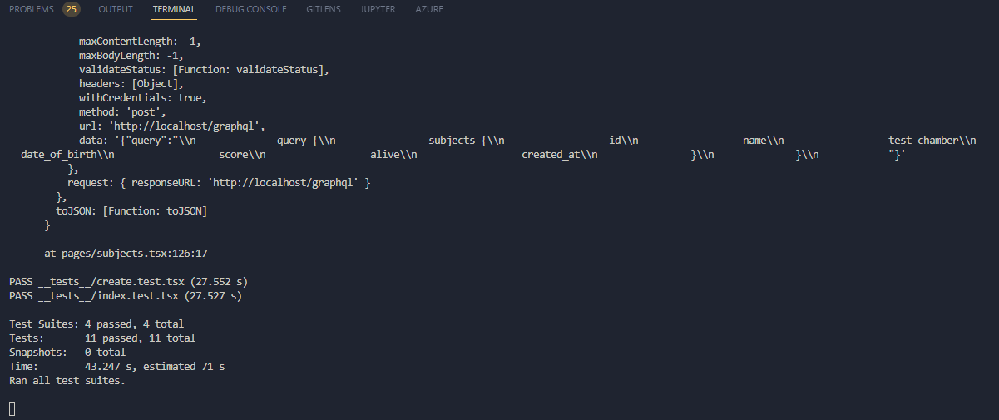
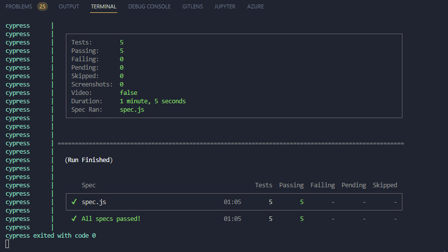

# Software Engineer Candidate technical challenge

As part of the recruitment process at intelliHR, we ask that complete this code challenge. We will review your submission and then conduct a code review in a formal interview setting.

In this repository you will find a simple application that produces a React UI which communicates via GraphQL to a Laravel service and Postgres database. The application will serve two pages, a login page and a subjects list. The application stack also includes unit and e2e tests.

For this challenge, you will require docker and docker-compose available in your working environment. This application also makes use of the docker-provided internal hostname.

---

## Launching development environment


Fork this repository and clone it into your working environment of choice.

Once available, run the following commands from the root directory:

1. `docker-compose up -d --build`
2. `docker exec laravel composer update`

In the laravel directory, duplicate the .env.example file as .env, and generate an application key

3. `cp .env.example .env`
4. ` docker exec laravel php artisan key:generate`

Migrate and seed data (from the root directory)

4. `docker exec laravel php artisan migrate`
5. `docker exec laravel php artisan db:seed --class=DatabaseSeeder`
6. `docker exec laravel php artisan db:seed --class=SubjectSeeder`

From the nextjs directory, run:

7. `yarn install`

Finally, launch the application with:

8. `docker-compose up`

You may now find the nextjs application served at localhost:3000 / host.docker.internal:3000. You may also access the laravel application at port 80 (though this will just return a Hello World).

The seeding steps above will create the following user:
**Email:** GLaDOS@aperture.com
**Password:** ISawDeer


### Testing

You will notice a cypress container deploying and executing e2e tests in the step above. You can re-run that process by

- `docker-compose up cypress`

There are also unit tests available:

- `docker exec laravel php artisan test`
- `docker exec nextjs yarn test`

Once you have the application stack running, you're ready to take on the challenges below!

---

## Challenge

### Aperture Science Enrichment Centre requires a new management system to conduct exciting new tests! Tests are questionnaires completed by (willing) human subjects, how exciting!

_Testing is the future, and the future starts with you._

## Software Engineer

Please complete the following user stories relative to the role you are applying for. You may optionally complete user stories from other role levels.

**Graduate Software Engineer:**

1. As an un-authenticated user, I should _not_ be able to request a subject list from the API. You will note that performing the following un-authenticated request currently returns data that should be protected.

```curl --location --request POST 'http://host.docker.internal/graphql' \
--header 'Content-Type: application/json' \
--data-raw '{"query":"query {\r\n    subjects(page: 1) {\r\n        data {\r\n            id\r\n            name\r\n        }\r\n    }\r\n}","variables":{}}'
```

2. As an authenticated user, I want to be able to sort testing subjects by age and testing chamber from within the interface.
3. As an authenticated user, I want to be able to sort testing subjects by age and testing chamber in my API requests.

**Software Engineer I:**

1. As an authenticated user, I want to be able to create testing subject records.
   - No extra library has been installed for this user story.
   - A navigation bar has been created for navigating between subjects and create pages.
   - Date of birth field also has time beside date according to the original data.
   - Added more input field verification using custom hook useForm and helper function validate, on both create and edit subject pages.
   - Page reloading can be a bit slow sometimes after creating, editing, deleting.
   - Changed tb tags to th tags in thead.
2. As an authenticated user, I want to be able to edit testing subject records.
   - No extra library has been installed for this user story.
   - Subject ID can't be changed, so ID field on edit page is disabled.
   - React context has been applied for sharing data between pages.
   - Added subject deletion and adjusted the table a bit wider accordingly.

### Tests:

1. Created two more frontend unit tests, and fixed an error in index.test.tsx file, and all passed
   
2. Created two more backend unit tests, still two failed, but they both work in postman, tried to fix don't know why really sorry
   
3. Fixed e2e tests, all passed, there are comments in spec.js file explaining why sometimes test still fails
   

### Errors in console:

1. Fixed Parsing error : Cannot find module 'next/babel'.
2. Fixed a potentail memory leak bug on subject page.
3. Uncaught TypeError: Cannot read properties of null (reading 'top') at record.js:1:29664, tried to find a way to solve it, searched in google, also had a look at record.js file, the error could be caused by strict mode, not sure, sorry can't solve this
4. Blocked autofocusing on a <div> element in a cross-origin subframe. error appears when copy date of birth from warning message on the same page, happens when trying to copy the right date of birth format from the warning message, usually it happens when use iframe, but didn't see iframe has been employed, not sure where this comes from

**Software Engineer II:**

1. As an authenticated user, I want to be able to create testing subject records.
2. As an authenticated user, I want to be able to edit testing subject records.
3. As an authenticated user, I want to be able to paginate through subject records in the interface.

**Senior Software Engineer:**

1. As an authenticated user, I want to be able to create testing subject records.
2. As an authenticated user, I want to be able to edit testing subject records.
3. As a testing subject, I want to be able to log into the system, but I should only be able to see/edit my own subject data.
4. As a testing subject, I want to be able to reset my password.

## Submissions

Please submit your response as a link to a forked repo (we will share accounts to invite if you wish to keep it private).

_Note:_ Testing and documentation are vital for software professionals, please keep that in mind when finishing your submission.
